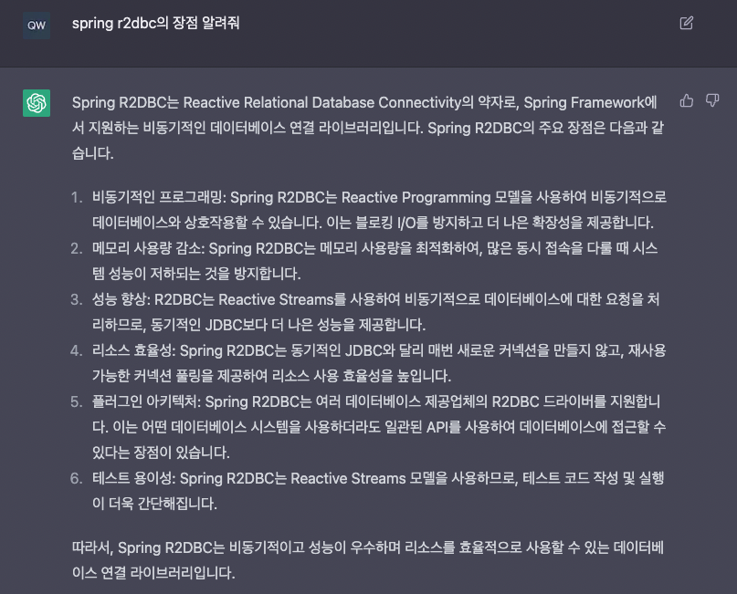

최근 `Coroutine`을 사용하면 기존 `Webflux` + `R2DBC` 조합의 복잡한 코드 들도 단순하게 구현이 가능하다는걸 알게 되어, 이참에 다시한번 `R2DBC` 복습 좀 하고 여러가지 테스트를 해보면서 알게 된 기록들을 남겨본다.

#### 사전지식 1.

최소한의 `webflux` 기본 동작방식을 알아야 한다. `webflux`는 적은 스레드로 많은 `request`를 처리하도록 설계되어 있다. `javascript`에서 이벤트 루프와 비슷한데, 오래 걸리는 작업이나 무거운 작업을 별도의 `event loop`로 넘겨 처리하고 완료되면 메인스레드에서 처리하는 방식이 비슷하다. `webflux`도 일단 reuqest 가 들어오면 스레드를 할당 받지만 이 `thread pool`은 tomcat과 비교하면 적은 개수로 운영하게 된다. 그래서 이 적은 스레드를 효과적으로 사용해야만 하고 request를 `blocking` 방식으로 처리하면 전체 시스템 퍼포먼스가 떨어질 수 도 있으니(`request`를 받아야할 스레드가 전부 blocking 상태가 될 수 있다) 항상 `non-blocking` 방식을 염두하고 개발해야한다.

#### 사전지식 2.

'동시성'과 '병렬성'의 차이를 알아야 한다. 아래 설명할 내용들은 대부분 '동시성'과 관련 된 내용이지만 필요하면 '병렬'로 처리하여 퍼포먼스를 극대화 할 수도 있다.

#### 사전지식 3.

`R2DBC`도 당연히 `Connection Pool` 개수를 조절 할 수 있다. 괜히 `CP`적게 잡아놓고 `R2DBC` 성능 안나온다고 삽질하면 안된다....

> R2DBC와 coroutine을 다루는 글이지만 개념적인 부분은 일부 설명 하더라도 자세한 설명이나 사용법 등은 여기서 설명 하진 않을 예정. 추후 다른글에서 webflux, coroutine에 대해 자세히 알아 볼 생각이다.

아래에서 설명할 샘플 코드는 [r2dbc 예제](https://github.com/qweasd147/StudyNote/tree/master/springboot/coroutine-r2dbc) 여기서 확인이 가능하다

## R2DBC

`Reactive Relational Database Connectivity`의 약자로 요즘 핫한 `chat gpt`로 검색하면 아래와 같은 답을 얻을 수 있다.



기존 `JDBC`를 사용하면 블로킹 방식이라 하나의 쿼리가 실행 중이라면 해당 `request`를 처리하는 스레드는 똑같이 블록킹이 걸리게 된다. `R2DBC`없이 `webflux`만 단독으로 사용하여도 이와 같은 이유 때문에 DB레벨에서 다 병목 현상이 발생하므로 `Webflux` 장점을 살릴 수 없게 된다.

또한 `R2DBC` 장점이 확실 하지만 반대로 단점도 너무나 확실하게 있다. 개발하면서 `Mono`, `Flux`를 계속하여 사용해야하는데 이걸 계속 쓰자니 많이 헤깔리고(물론 익숙하지 않아서 그런것도 있다), 가독성 문제가 가장 크다고 생각한다.

```java
  public Mono<ServerResponse> findOne(ServerRequest request){

    return Mono.just(request.pathVariable("articleIdx"))
            .map(Long::parseLong)
            .flatMap(articleIdx -> articleRepository.findByIdx(articleIdx))
            .flatMap(article-> ServerResponse.ok().body(Mono.just(article), Article.class))
            .switchIfEmpty(ServerResponse.notFound().build());
  }
```

이건 예전에 사용하던 코드 이긴하지만 이런식으로 메소드 체이닝하여 계속 사용하게 되고, 그렇다고 안쓰자니 `non blocking` 코드를 구현 할 수가 없다(`Webflux` 쓰는 장점이 없다).

또 다른 문제로 `R2DBC`는 `ORM`이 아니다. `Hibernate` 같은 `ORM`에 익숙한 사람이라면 사용하다보면 `Hibernate`와 비교하여 하나씩 하나씩 지원 안해주는 `R2DBC`가 꽤나 불편하게 느껴질 수 있다.

## Coroutine

기본적인 여러 작업들을 동시에 처리가 가능하다. 기존에도 `future(CompletableFuture 같은거)`를 쓰거나 멀티 스레드를 사용하면 기본적인 `non-blocking` 프로그래밍이 가능하지만 내부적으로 별도의 스레드 풀을 구성하여 리소스 문제나 막상 코드를 보면 어쩔수 없는 callback 등을 남발하기도 하고, 이런 코드들을 기존의 다른 코드와 연결 지으며 코딩하다보면 가독성이 매우매우 떨어지게 된다. 하지만 코루틴을 사용하면 기존 코딩 스타일로도 `non-blocking`하게 개발이 가능하며, 이는 내부적으로 하나의 스레드로 동작(일반적으로)하지만 `continuation`이라는 처리 후 복귀 지점을 내부적으로 관리하여 각 `suspend` 함수는 종료 후 어디로 복귀하여 처리하는지를 알고 있다.

> 즉 하나의 스레드로 여러 작업을 처리 하고 `continuation`을 통해 절차지향 적인 코드로도 비동기 처리가 가능하게 된다.

```kotlin

fun main(args: Array<String>) {

    callWithDelay()
}

fun callWithDelay() = runBlocking {

    val runningSeconds = measureTimeMillis {

        //1초 + 1초 + 1초 -> 1.x초
        val deffer1 = async { delay(1000) }
        val deffer2 = async { delay(1000) }
        val deffer3 = async { delay(1000) }

        awaitAll(deffer1, deffer2, deffer3)

    }.toDuration(DurationUnit.MILLISECONDS).toDouble(DurationUnit.SECONDS)

    println("delay 걸린 시간 $runningSeconds")
}

//delay 걸린 시간 1.017
```

이런방식으로 `R2DBC` + `Coroutine`조합을 사용하여 쿼리들을 요청하면 결과적으로 **실행 시간 단축. 즉, 전체 처리 시간이 빨라 질 것**이라 기대했다.

## R2DBC + Coroutine

여러 쿼리를 병렬로 실행하여 시간단축이 가능한지를 테스트 해보려고 일단 쿼리 수준에서 강제로 `slow query`를 만들어 여러번 요청 하도록 만들었다. `slow query`는 아래와 같이 대략적인 걸린 시간 값을 예상 할 수 있게 만들었다.

```sql
SELECT sleep(1) FROM article LIMIT 5
```

> 그냥 `SELECT sleep(5)` 로도 충분하지만 혹시 내가 모르는 상황이 있을까 table을 끼고 조회하였다.

**kotlin 코드**

```kotlin
@Repository
interface ArticleRepository : CoroutineCrudRepository<Article, Long> {

    @Query("SELECT sleep(1) FROM Article article LIMIT 5")
    suspend fun blockingFor5Sec(): List<Int>

    @Query("SELECT sleep(1) FROM Article article LIMIT :seconds")
    suspend fun blockingFor(seconds: Int): List<Int>
}
```

```kotlin
@Service
@Transactional(readOnly = true)
class ArticleService(
    private val articleRepository: ArticleRepository,
) {

    val log = KotlinLogging.logger {}

    suspend fun callQueries() = coroutineScope {

        val runningSeconds = measureTimeMillis {

            val deffer1 = async { articleRepository.blockingFor5Sec() }
            val deffer2 = async { articleRepository.blockingFor(3) }

            awaitAll(deffer1, deffer2)

        }.toDuration(DurationUnit.MILLISECONDS).toDouble(DurationUnit.SECONDS)

        log.info("running time $runningSeconds 초") //약 8초???
    }
}
```

해당 함수를 호출하면 아와 같은 에러가 발생한다.

```
org.springframework.r2dbc.UncategorizedR2dbcException: executeMany; SQL [SELECT sleep(1) FROM Article article LIMIT ?]; Unknown exception
	at org.springframework.r2dbc.connection.ConnectionFactoryUtils.convertR2dbcException(ConnectionFactoryUtils.java:246) ~[spring-r2dbc-6.0.4.jar:6.0.4]
	Suppressed: reactor.core.publisher.FluxOnAssembly$OnAssemblyException:
...
...
...
```

#### 발생 이유

에러메세지 첫 줄에서도 볼 수 있듯이, 'executeMany' 때문에 에러가 발생 한 것이다. 기존 쿼리가 종료 되기 전, 다른 쿼리를 요청하여 발생한 것인데 하나의 트랜잭션 내에서 여러 쿼리를 요청 할 수가 없다.

조금 더 풀어서 설명하자면 같은 트랜잭션에서 여러 `connection`을 사용 한다던지, 아님 하나의 `connection`으로 여러 쿼리를 요청 한다던지 하는 것은 불가능 하다. 그게 `read only`트랜잭션 일지라도 똑같이 적용 된다.

> 사실 가능하긴 하지만 트랜잭션 처리 속도가 떨어져서 일반적으로 사용을 안하게 된다.

`R2DBC`는 이런 한계를 개선 한 기술은 아닌것이다. `R2DBC`는 `pub/sub` 기반으로 구현되어, 비동기로 DB와 통신하고 결과를 응답 받을 수 있게 만들어 놓은걸로, DB에서 결과를 받을 때 까지 어플리케이션에서 스레드를 다른곳에서 사용할 수 있도록 만들어 놓은 정도로 이해하면 된다. 감이 잘 안잡힌다면 동시성과 병렬성의 차이를 이해하고 `R2DBC`는 동시성에 집중 되어 있다고 생각하면 된다.

> `R2DBC`를 공부하다보면 동시성과 연관지어 설명하는 글은 많아도 병렬성에 대한 말은 없다. 이는 `R2DBC`는 동시성에 초점을 두었기 때문이다.

또한 DB 물리적인 트랜잭션이 나누어 있거나 적용 되어있지 않은거(외부 api통신 등)라면 `coroutine`의 `async`등을 사용하여 동시에 처리가 가능하다

```kotlin
suspend fun maybe8Seconds(request: ServerRequest): ServerResponse = coroutineScope {

    val runningSeconds = measureTimeMillis {

        val deffer1 = async { articleService.maybe5Seconds() }
        val deffer2 = async { articleService.maybe8Seconds() }

        awaitAll(deffer1, deffer2)
    }.toDuration(DurationUnit.MILLISECONDS).toDouble(DurationUnit.SECONDS)

    log.info("running time $runningSeconds 초") //전체 걸린 시간 8.x초

    ServerResponse.ok().buildAndAwait()
}
```

분리 된 트랜잭션으로 처리해도 괜찮다면 이런식으로 사용이 가능하다. 물론 하나의 트랜잭션 내에선 `R2DBC`를 사용 하더라도 쿼리 요청 관련해선 순차적으로 잘 실행 되니까 문제 될 것은 없다.

```kotlin
@Transactional(readOnly = true)
suspend fun maybe8Seconds() = coroutineScope{

    val queryDeffer = async {
        //아래 쿼리 2개는 순서대로 잘 처리 된다.
        articleRepository.blockingFor(5)
        articleRepository.blockingFor(3)
    }

    val delayDeffer = async {
        delay(1000L)
        delay(1000L)
    }

    awaitAll(queryDeffer, delayDeffer) //약 8.x초가 걸린다.
}
```

대략적으로 10초가 아닌 8초가 걸리는 이유는 `queryDeffer`가 실행 되면서 다른 작업(`delayDeffer`)도 처리가 가능하여 8초가 걸리게 된다.

---

`Webflux` + `Coroutine`을 사용하다보면 `non-blocking`을 지원해주는 라이브러리만 쓰면 사용하는데 큰 무리가 없지만 막상 개발하다보면 그렇지 않은 케이스가 너무나 많다. 무조건 `Coroutine`만 사용한다고 항상 최고의 퍼포먼스를 보여주는것도 아니고, 똑같이 `blocking` 되는 상황을 피해야 그 효과가 좋다. 문제는 `Reactive`형태로 지원하지 않는 코드를 가져다 쓸 때 `blocking`되는 상황이 만들어지면 별도의 `Coroutine Scope`를 만들어야 할 수도 있고, 작업에따라 어떠한 `Dispatcher`를 사용해야 할지 고민이 될 수도 있다. 또한 이런 `scope`를 만들다 보면 에러 발생 시 처리 정책(`SupervisorJob` 같은거) 등도 고민 해봐야 할 것이다.

하고 싶은 말은 코드만 봐선 쉬워보이는데 개발하다 보면 이것 또한 쉽지는 않다는 생각이 많이 들었다.
